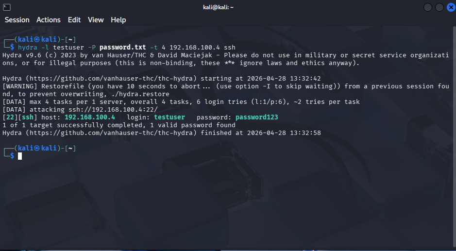

# SSH Brute Force Attack

## Objective

Simulate a brute-force attack against an SSH service and observe authentication behavior.

---

## Environment

- Attacker: Kali Linux (192.168.100.5)
- Target: Ubuntu (192.168.100.4)
- Service: SSH (Port 22)

---

## Attack Execution

A controlled password list was used to simulate brute-force attempts:

hydra -l testuser -P passwords.txt -t 4 192.168.100.4 ssh

📸 Attack Execution:

---

## Result

The attack successfully identified valid credentials:

login: testuser password: password123

---

## Observations

- Multiple failed login attempts were generated
- Authentication retries exceeded threshold
- Eventually, valid credentials were discovered

---

## Security Insight

Weak passwords significantly increase the risk of account compromise through brute-force attacks.

