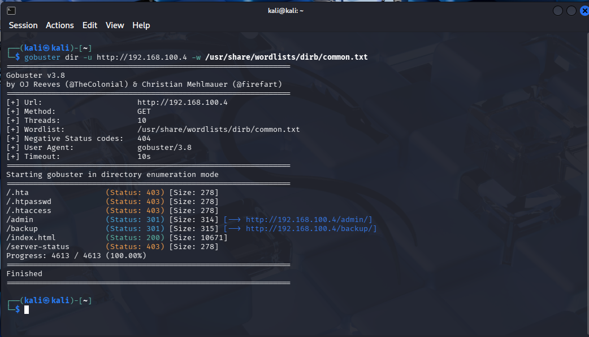

# Web Enumeration Attack (Directory Brute Force)

## Objective

Simulate a web directory enumeration attack and observe how it appears in server logs.

---

## Environment

- Attacker: Kali Linux (192.168.100.5)
- Target: Ubuntu (192.168.100.4)
- Service: Apache Web Server (Port 80)

---

## Attack Execution

The following command was used to enumerate directories:

gobuster dir -u http://192.168.100.4 -w /usr/share/wordlists/dirb/common.txt

📸 Attack Execution:

---

## Results

The scan identified existing directories:

- /admin
- /backup

---

## Observations

- Large number of HTTP GET requests generated
- Requests made in rapid succession
- Multiple 404 responses observed
- Enumeration of hidden directories detected

---

## Security Insight

Directory enumeration is often used by attackers to discover hidden endpoints and sensitive resources before exploitation.
