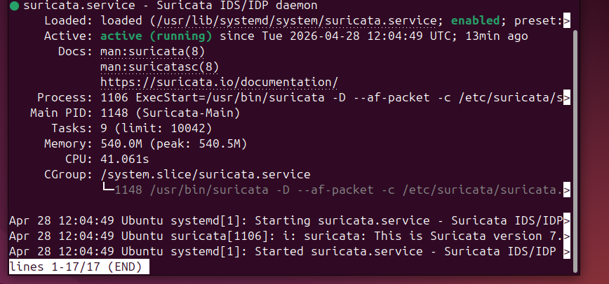
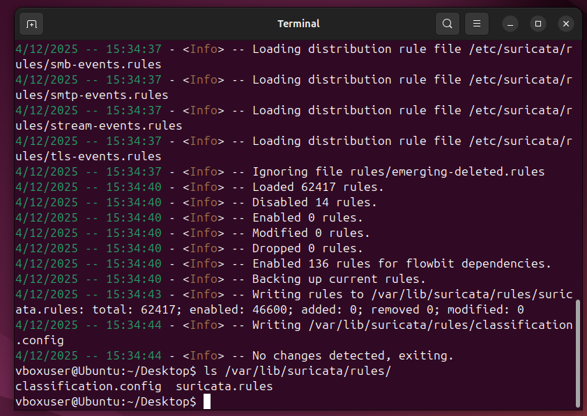
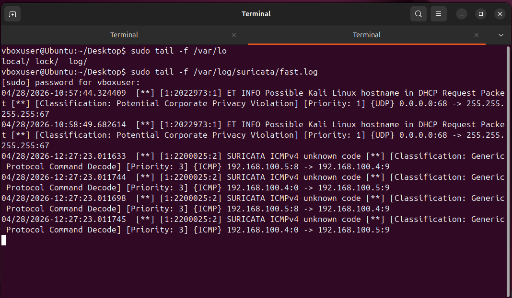

# Lab Setup

This lab simulates a small enterprise-like network for practicing
blue-team defensive skills, including log analysis, network monitoring,
intrusion detection, and incident response.

## Environment

- Attacker VM: Kali Linux
- Target VM: Ubuntu
- Network: Host-only / NAT (same subnet)

## IDS Setup

- Tool: Suricata
- Interface: enp0s3
- Mode: IDS (live packet inspection)

## Verification

Suricata running:

Rules loaded:

Live alerts:

## Status

Suricata installed  
Interface configured  
Rules loaded (62,000+)  
Logging working  
Basic detection (ICMP, DHCP)  

Lab ready for attack simulation and analysis.