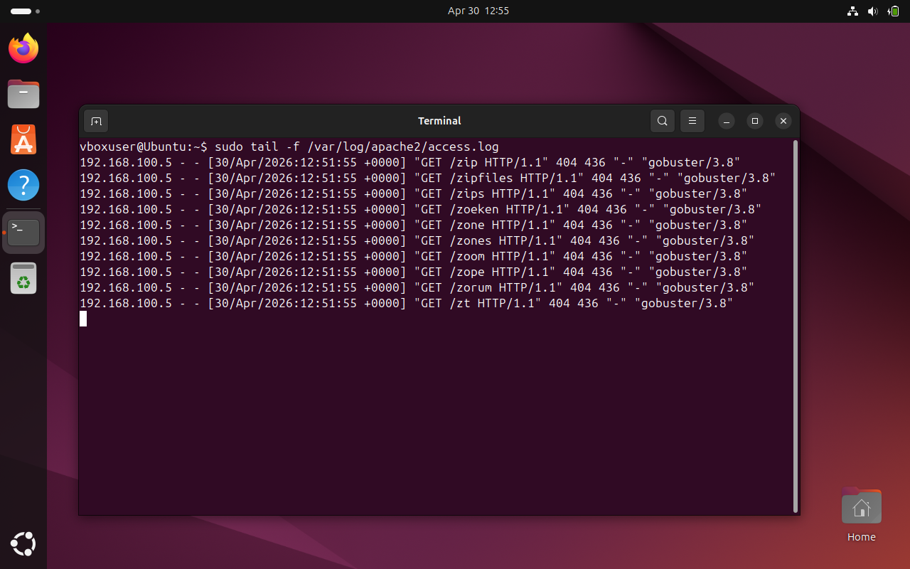

# Web Enumeration Analysis

## Overview

This analysis focuses on HTTP access logs generated during a directory enumeration attack using Gobuster.

---

## Log Source

- File: /var/log/apache2/access.log
- Service: Apache Web Server

---

## Sample Log Entries

GET /zip HTTP/1.1 404
GET /zips HTTP/1.1 404

📸 Log Evidence:  

---

## Key Indicators

- **Source IP:** 192.168.100.5 (Attacker)
- **Target:** Web server (192.168.100.4)
- **Method:** HTTP GET
- **User-Agent:** gobuster/3.x

---

## Detection Pattern

Indicators of directory enumeration:

- High volume of HTTP requests in short time
- Sequential requests to different endpoints
- Large number of 404 responses
- Presence of automated scanning user-agent

---

## Analysis

- The attacker sent multiple requests to discover hidden directories
- Many requests resulted in 404 responses, indicating probing behavior
- Valid directories such as `/admin` and `/backup` were discovered
- The request pattern is automated and non-human

---

## Conclusion

The access logs clearly indicate a directory brute-force attack using Gobuster.

This type of activity is commonly used in reconnaissance to identify hidden web resources.

---

## Security Insight

Web enumeration attacks can expose sensitive directories and should be monitored using access logs and anomaly detection.