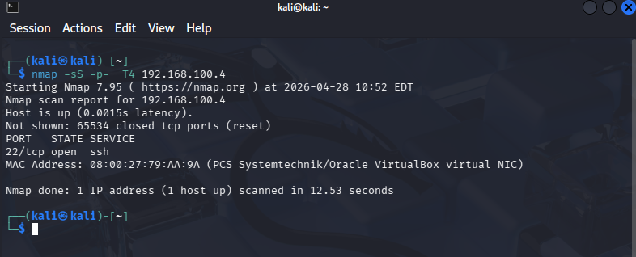
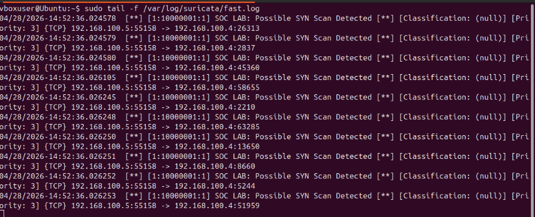

# Incident Report – Port Scan Detection

## Summary

A potential reconnaissance activity was detected on the network, originating from an internal host performing a TCP SYN scan against the target system.

---

## Incident Details

- **Date/Time:** 04-28-2026 14:52:36
- **Source IP:** 192.168.100.5
- **Destination IP:** 192.168.100.4
- **Attack Type:** TCP SYN Port Scan
- **Detection Tool:** Suricata IDS

---

## Description

The IDS generated multiple alerts indicating a high volume of TCP SYN packets sent from the attacker to the target across multiple ports.

This behavior is consistent with a port scanning technique used to identify open services on a system.

---

## Evidence

📸 Nmap Scan:

📸 Suricata Alerts:

---

## Analysis

- Large number of SYN packets observed in a short time frame
- No full TCP handshake completion
- Traffic pattern aligns with reconnaissance activity
- Indicates enumeration of open ports/services

---

## Impact

- Exposure of open ports and services
- Increased risk of targeted attacks
- Potential precursor to exploitation attempts

---

## Mitigation

- Implement firewall rules to restrict unnecessary ports
- Enable rate limiting for incoming connections
- Deploy IDS/IPS with tuned detection rules
- Monitor for repeated scanning attempts

---

## Conclusion

The detected activity represents a TCP SYN port scan conducted from an internal host.  
The use of Suricata with a custom detection rule enabled successful identification of this reconnaissance behavior.

---

## Analyst Notes

This scenario highlights the importance of:
- Custom detection tuning
- Continuous monitoring
- Understanding attacker behavior patterns