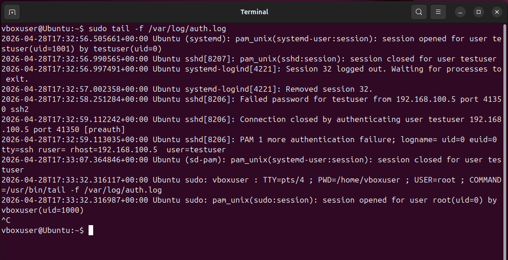

# Incident Report – SSH Brute Force Attack

## Summary

A brute-force attack was detected against the SSH service on the target system, resulting in successful compromise of a user account.

---

## Incident Details

- **Date/Time:** 2026-04-28 17:32:57
- **Source IP:** 192.168.100.5
- **Destination IP:** 192.168.100.4
- **Target User:** testuser
- **Attack Type:** SSH Brute Force
- **Detection Source:** System authentication logs (/var/log/auth.log)

---

## Description

The system recorded multiple failed SSH login attempts from a single source IP targeting the same user account.

The attack continued until valid credentials were discovered, resulting in successful authentication.

---

## Evidence

📸 Hydra Attack:

📸 Authentication Logs:

---

## Analysis

- High frequency of failed login attempts observed
- Same source IP repeatedly targeting the same user
- Authentication retry limits exceeded
- Successful login observed after multiple failures

This pattern strongly indicates a brute-force attack.

---

## Impact

- Unauthorized access to user account (testuser)
- Potential system compromise
- Risk of privilege escalation and lateral movement

---

## Mitigation

- Enforce strong password policies
- Implement account lockout after failed attempts
- Deploy Fail2Ban or similar tools
- Restrict SSH access (e.g., IP allowlisting)
- Use multi-factor authentication (MFA)

---

## Conclusion

The system was subjected to an SSH brute-force attack, which successfully compromised user credentials.

This incident highlights the importance of monitoring authentication logs and enforcing strong security controls.

---

## Analyst Notes

This scenario demonstrates:
- Detection through host-based logs
- Identification of attack patterns
- Understanding of credential-based attacks